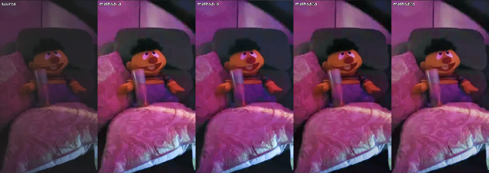
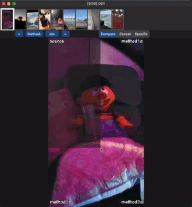
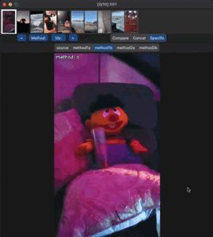
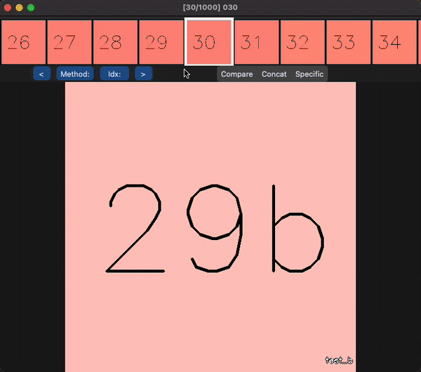
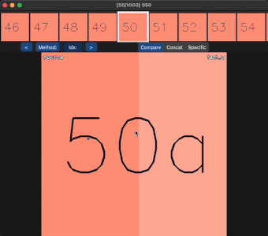
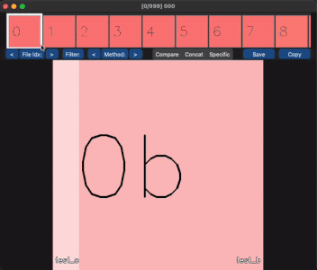

# Visual Comparison

## Introduction
A tool for comparing images & videos, to aid research in image/video enhancement.

- Removes need to generate comparison images
- Quickly switch between files and methods using keybindings or buttons
- 3 different comparison modes for more effective comparison
- Preview and filter window to quickly search, filter and skip to desired images
- Zoom to see fine details or enhancement

Simply generate your enhanced images/videos, store it together with outputs from other methods and source images. Then,
run the application, and select the root folder and preview folder using the GUI.

## Problem

Able to spot the differences?



How about now?


| Compare (Up to 4) | Show Specific | Concat |
| --- | --- | --- |
|  |  |  |
| Shows up to 4 files at once. Move mouse accordingly | Shows a single method based on what the user selected (with their keyboard) | Display all files horizontally. Still useful for images with large differences |

Interested in looking at small regions of the image?

| Zoom (Compare) | Zoom (Specific) | Zoom (Concat) |
| --- | --- | --- |
|  |  |  |

Many files or methods to compare?

| Mouse/Keyboard Control | Button Control | File filtering |
| --- | --- | --- |
|  |  |  |
| Navigate files using 'a', 'd' or arrow keys. Scroll to preview other files | Select which method to compare and jump to specific index | Filter/sort files by name, height, width, etc. |

## Usage

### <u> Installation </u>

Create a virtual environment with Python 3.8.10 Then,

```
pip3 install -r requirements.txt
```

Next, install the necessary package for the copy image to clipboard feature
```
# MacOS - None

# Windows
pip3 install pywin32

# Linux
pip3 install klembord
```


### <u> Folder Structure </u>

Your files should be stored in the following manner:

```
root
├── file1.jpg  # Files will be excluded
├── method_1  # Could be name of algorithm or outputs from epoch
    ├── file1
    ├── file2
    └── ...
├── method_2
    ├── file1
    ├── file2
    └── ...
└── source  # source folder (used for preview). Can be specified in run.py
    ├── file1
    ├── file2
    └── ...
```

Requirements
- Minimum of 2 folders since this is a comparison tool.
- Each folder contains enhanced images from a single method.
- Each file must have the same name as the source file.
- Files which have the same name across <b><u>ALL</u></b> subdirectories will be retrieved.
- Images & videos should all have the same size (since we need to overlay/crop and join them)
- Files in root folder will be excluded

### <u> Running the program </u>
```
usage: run.py [-h] [--root ROOT] [--preview_folder PREVIEW_FOLDER]

optional arguments:
  -h, --help            show this help message and exit
  --root ROOT           Path to root directory
  --preview_folder PREVIEW_FOLDER
                        Folder to preview
```

## More Info

For more information and instructions on how to use the application, refer to the [Wiki](https://github.com/shaunhwq/visual_comparison/wiki)
