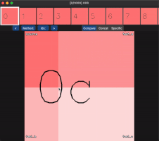

# visual_comparison
A tool for comparing images &amp; videos.

| Compare (Up to 4)                                   | Show Specific                                                               | Concatenate                    |
|-----------------------------------------------------|-----------------------------------------------------------------------------|--------------------------------|
|                              |                                                     |          |
| Shows up to 4 files at once. Move mouse accordingly | Shows a single method based on what the user selected (with their keyboard) | Display all files horizontally |

## Installation

Either create a virtualenv or conda env. Tested on python 3.8. After activating,

```
pip3 install customtkinter opencv-python pillow tqdm
```

## Usage

### File Structure
```
File structure should be as follows:

root
├── algorithm_name1
    ├── file1
    ├── file2
    └── ...
├── algorithm_name2
    ├── file1
    ├── file2
    └── ...
└── ...
```

- Note that only files which have the same name across <b><u>ALL</u></b> subdirectories will be retrieved.
- Also, images & videos should all have the same size (since we need to overlay/crop and join them)

### Running the program
```
usage: app.py [-h] --root ROOT

optional arguments:
  -h, --help   show this help message and exit
  --root ROOT  Path to root directory
```

### Instructions

| Action                  | Description                                                      |
|-------------------------|------------------------------------------------------------------|
| Press "1" to "9"        | Switches to specific mode, or toggles back to comparison mode    |
| Press "d" or "a"        | Show previous or next file                                       |
| Press "space"           | Pauses the video (if there is one)                               |
| Click on video slider   | Skips to selected part of video                                  |
| Scroll mouse            | Moves the preview window                                         |
| Click in preview window | Changes to selected file                                         |
| Click on "Method:"      | Popup appears to select methods to show                          |
| Click on "Idx:"         | Popup appears to change to index, must be int and < number files |
