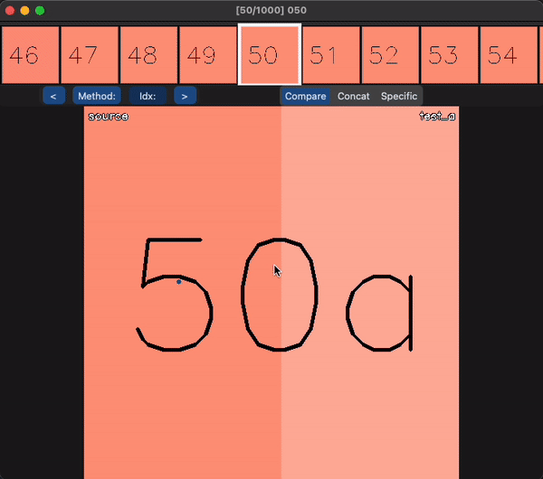

# visual_comparison

Ever have trouble comparing images/videos? This might be the tool for you if:
1. You find it hard to observe minute differences between images
2. Find it troublesome to generate side by side comparisons of images/videos
3. Want to increase your comparison speed

Able to see the difference between various enhancement methods?


How about now?


| Compare (Up to 4) | Show Specific | Concat |
| --- | --- | --- |
|  |  |  |
| Shows up to 4 files at once. Move mouse accordingly | Shows a single method based on what the user selected (with their keyboard) | Display all files horizontally. Still useful for images with large differences |

Not clear enough?

| Zoom (Compare) | Zoom (Specific) | Zoom (Concat) |
| --- | --- | --- |
|  |  |  |

Many files or methods to compare?

| Mouse/Keyboard Control | Button Control |
| --- | --- |
|  |  |
| Navigate files using 'a', 'd' or arrow keys. Scroll to preview other files | Select which method to compare and jump to specific index |

Note: Some compression between video to GIF so there are some distortions.

## Installation

Either create a virtualenv or conda env. Tested on python 3.8. After activating,

```
pip3 install customtkinter opencv-python pillow tqdm
```

## Usage

### File Structure
```
File structure should be as follows:

root
├── algorithm_name1
    ├── file1
    ├── file2
    └── ...
├── algorithm_name2
    ├── file1
    ├── file2
    └── ...
└── ...
```

- Note that only files which have the same name across <b><u>ALL</u></b> subdirectories will be retrieved.
- Also, images & videos should all have the same size (since we need to overlay/crop and join them)

### Running the program
```
usage: app.py [-h] --root ROOT

optional arguments:
  -h, --help   show this help message and exit
  --root ROOT  Path to root directory
```

### Instructions

| Action | Description |
| --- | --- |
| Press "1" to "9" | Switches to specific mode, or toggles back to comparison mode |
| Press "a" or "d" or arrow keys "left" or "right" | Show previous or next file |
| Press "space" | Pauses the video (if there is one) |
| Click on video slider | Skips to selected part of video |
| Scroll mouse | Moves the preview window |
| Click in preview window | Changes to selected file |
| Click on "Method:" | Popup appears to select methods to show |
| Click on "Idx:" | Popup appears to change to index, must be int and < number files |

#### Zooming

| Action | Description |
| --- | --- |
| Click on image once | Filled circle appears on screen to indicate first point |
| Click on image again | Rectangle will appear on screen, and crop region will be displayed together with the original |
| Click on image again (with 2 points) | Toggle between frozen and unfrozen bounding box |
