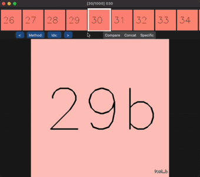

# Visual Comparison

## <u> Introduction </u>
A tool for comparing images & videos.

Generally, for the image/video enhancement problem, differences between
enhancement methods are hard to spot. Are you able to spot any differences between these enhanced images?


How about now?


| Compare (Up to 4) | Show Specific | Concat |
| --- | --- | --- |
|  |  |  |
| Shows up to 4 files at once. Move mouse accordingly | Shows a single method based on what the user selected (with their keyboard) | Display all files horizontally. Still useful for images with large differences |

Interested in looking at small regions of the image?

| Zoom (Compare) | Zoom (Specific) | Zoom (Concat) |
| --- | --- | --- |
|  |  |  |

Many files or methods to compare?

| Mouse/Keyboard Control | Button Control |
| --- | --- |
|  |  |
| Navigate files using 'a', 'd' or arrow keys. Scroll to preview other files | Select which method to compare and jump to specific index |

If you found that this is better, perhaps this tool is for you.
1. No need to generate comparison images/videos
2. Use keyboard and mouse to quickly navigate and compare
3. Various modes of operation for better and faster comparison

Simply generate your enhanced images/videos, store it together with outputs from other methods and source images. Then,
run the application, passing the path to the containing folder as an input.

## <u> Installation </u>

Either create a virtualenv or conda env. Tested on python 3.8. After activating,

```
pip3 install customtkinter opencv-python pillow tqdm
```

Next, install the following packages for copy image to clipboard functionality
```
# MacOS - None

# Windows
pip3 install pywin32

# Linux
pip3 install klembord
```

## <u> Usage </u>

### File Structure and Requirements
File structure should be as follows:

```
root
├── method_1  # Should be name of algorithm
    ├── file1
    ├── file2
    └── ...
├── method_2
    ├── file1
    ├── file2
    └── ...
└── source
    ├── file1
    ├── file2
    └── ...
```

- Requires a minimum of 2 folders since this is a comparison tool.
- Recommended to store enhanced images in their own folder. File names must be exactly the same as the source file name.
- Files which have the same name across <b><u>ALL</u></b> subdirectories will be retrieved.
- Images & videos should all have the same size (since we need to overlay/crop and join them)

### Running the program
```
usage: run.py [-h] --root ROOT [--source_folder SOURCE_FOLDER]

optional arguments:
  -h, --help            show this help message and exit
  --root ROOT           Path to root directory
  --source_folder SOURCE_FOLDER
                        Name of source folder
```

### Instructions

| Action | Description |
| --- | --- |
| Press "1" to "9" | Switches to specific mode, or toggles back to comparison mode |
| Press "a" or "d" or arrow keys "left" or "right" | Show previous or next file |
| Press "z" or "c" or arrow keys "up" or "down" | Show previous or next method |
| Press "space" | Pauses the video (if there is one) |
| Click on video slider | Skips to selected part of video |
| Scroll mouse | Moves the preview window |
| Click in preview window | Changes to selected file |
| Click on "Method:" | Popup appears to select methods to show |
| Click on "Idx:" | Popup appears to change to index, must be int and < number files |
| Ctrl/Cmd + c | Copy current view in display to clipboard, can be pasted elsewhere |
| Ctrl/Cmd + s | File window popup appears for saving current view to a file |

#### Zooming

| Action | Description |
| --- | --- |
| Click on image once | Filled circle appears on screen to indicate first point |
| Click on image again | Rectangle will appear on screen, and crop region will be displayed together with the original |
| Click on image again (with 2 points) | Toggle between frozen and unfrozen bounding box |
